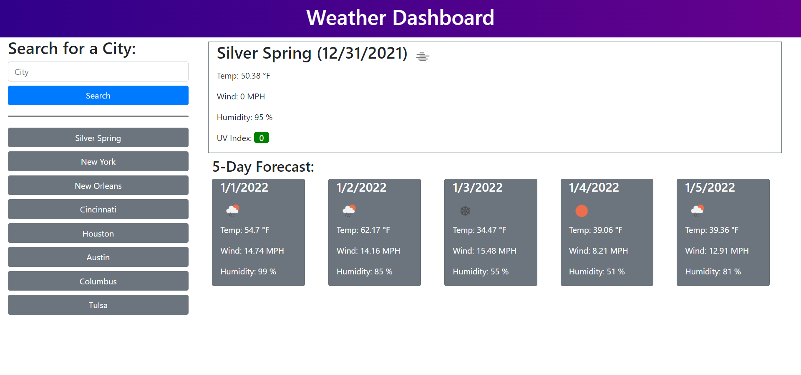

# Weather Dashboard

## Website

https://chris-backes.github.io/weather-dashboard/

## Screenshot



## Gif

<p align="center">

</p>

## User Story
```
AS A traveler
I WANT to see the weather outlook for multiple cities
SO THAT I can plan a trip accordingly
```

## Acceptance Criteria
```
GIVEN a weather dashboard with form inputs
WHEN I search for a city
WHEN I view current weather conditions for that city
THEN I am presented with the city name, the date, an icon representation of weather conditions, the temperature, the humidity, the wind speed, and the UV index
WHEN I view the UV index
THEN I am presented with a color that indicates whether the conditions are favorable, moderate, or severe
WHEN I view future weather conditions for that city
THEN I am presented with a 5-day forecast that displays the date, an icon representation of weather conditions, the temperature, the wind speed, and the humidity
WHEN I click on a city in the search history
THEN I am again presented with current and future conditions for that city
```

## Description

This web app responds to user requests for weather in specific locations by fetching data from a server side API and inputting that data into the HTML. The website utilizes HTML, CSS, and JavaScipt, along with BootStrap and JQuery.

Previous searches are stored in local storage, and upon the page load, those previous searches are pulled up and displayed below the search. The stored results are limited to eight most recent and unique searches, to prevent the list from running too long.

There are two fetch requests, becausue the second one requires data from the first.